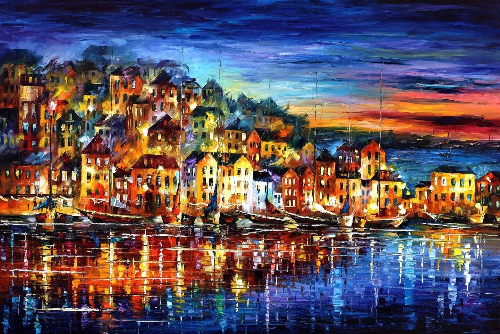
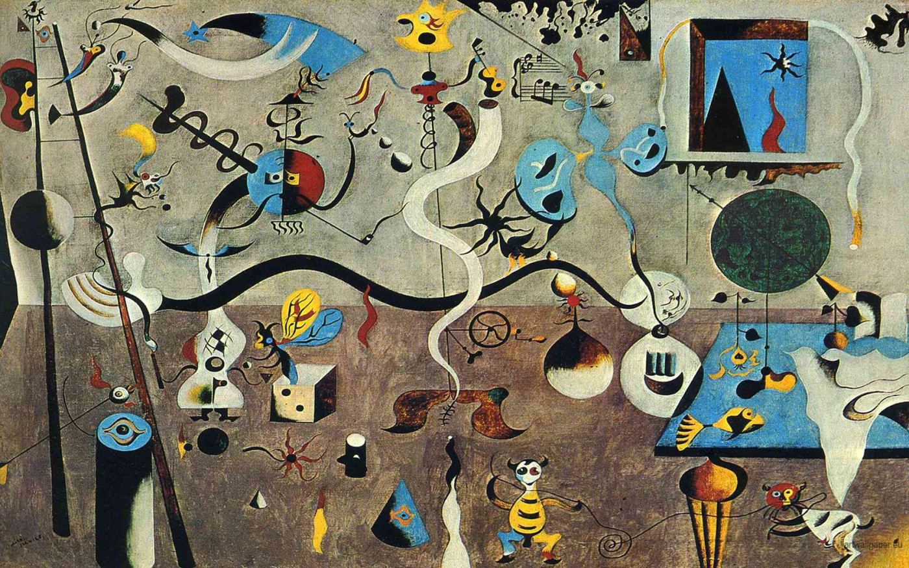
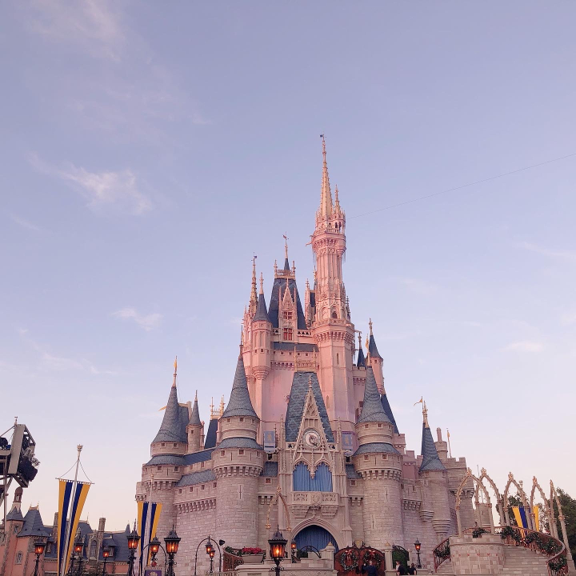
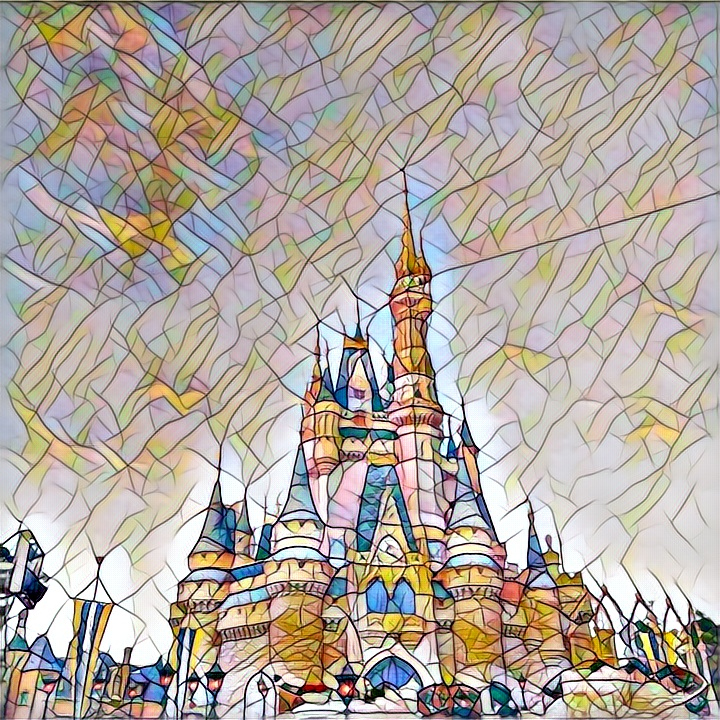
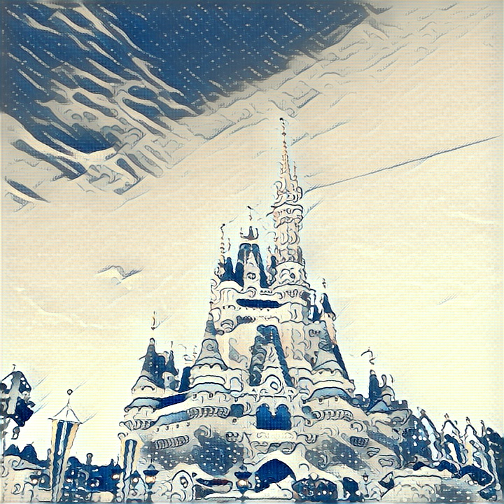
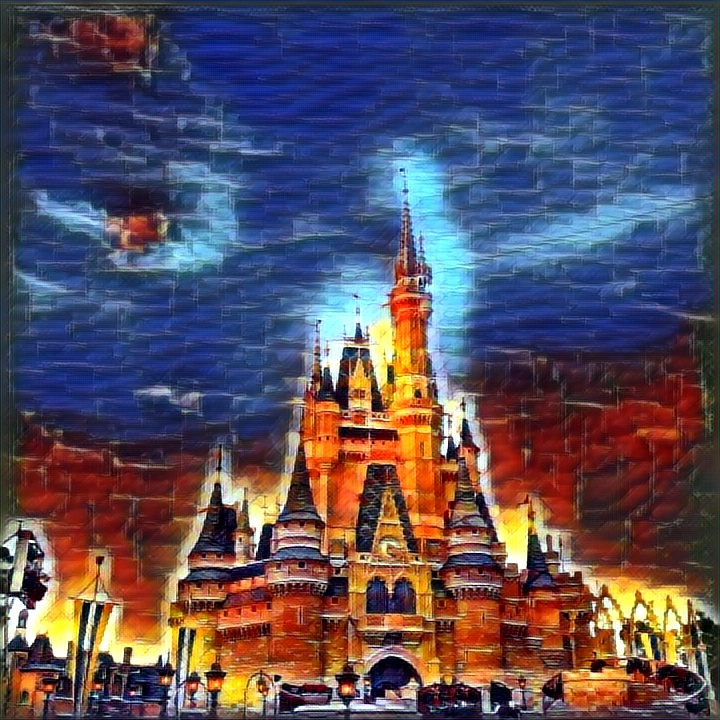
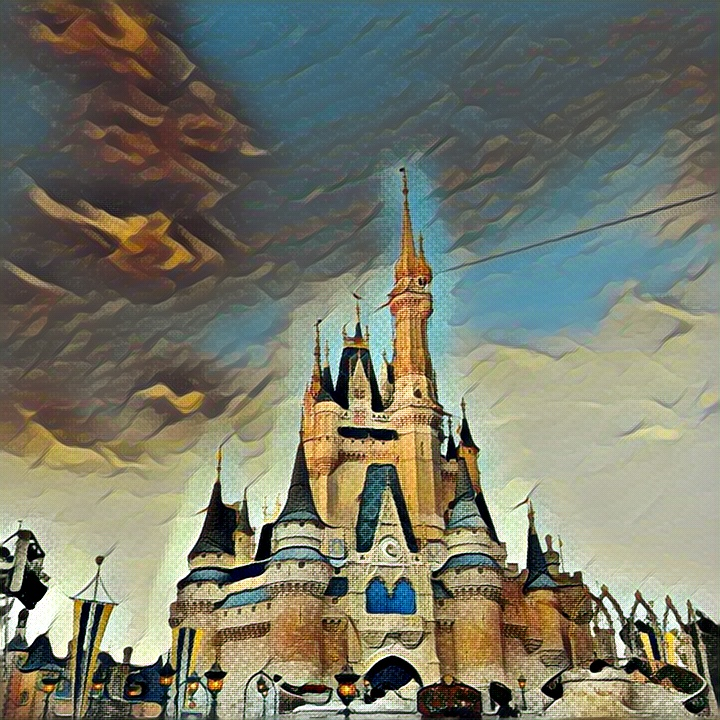

# Style Transfer of Images and Videos

Style transfer allows us to learn from the artistic styles of existing artworks and generating new visually pleasing results with the style learned. This repository contains 2 versions of style transfer implemented with PyTorch. The first version generally follows ideas in the paper "Image Style Transfer Using Convolutional Neural Networks" by Gatys et al. The second version generally follows ideas in the paper "Perceptual Losses for Real-time Style Transfer and Super-resolution" by Johnson et al. Details of the implementations can be found in the [report](./report.pdf).

## Demo

### Example 1

Original |  Mosaic |  Wave |  Afremov |  Miro
|:-----------:|:----------------:|:------------------------:|:------------------------:|:-------------------------:|
&nbsp; |  |  |  |  |
|  |  |  |  |


## To Run

### To run version 1

- Follow instructions in [the Version 1 notebook](./version1/style_transfer_version1.ipynb)

### To run version 2

- Clone the repository
  ```
  git clone https://github.com/YichengShen/style-transfer-pytorch-implementations.git
  ```
- Upload the repository folder to Google Drive
- Keep the folder structure as the following
  ```
  .
  ├── images                                    
  │   ├── content_images          # Folder that contains original images that you want to stylize    
  │   ├── style_images            # Folder that contains images with the styles to learn from    
  │   └── result_images           # Folder to save stylized images  
  ├── videos                            
  │   ├── content_videos          # Folder that contains original videos that you want to stylize               
  │   └── result_videos           # Folder to save stylized videos
  ├── training_checkpoints        # Folder to save model checkpoints
  ├── trained_transformations     # Folder that contains weights of styles that have been trained
  ├── version1
  │   └── style_transfer_version1.ipynb
  └── style_transfer_version2.ipynb
  ```
- Follow instructions in [the Version 2 notebook](./style_transfer_version2.ipynb). Make sure you place images in appropriate folders and properly change the config in the notebook.
